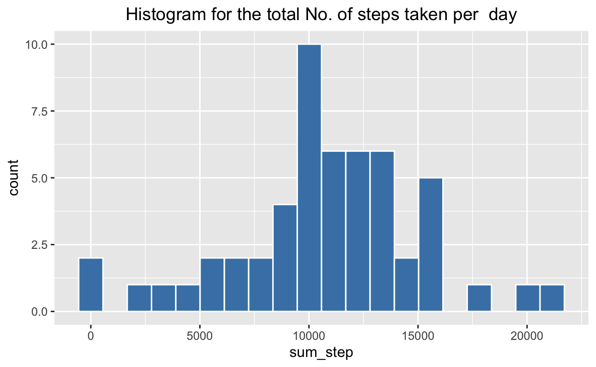
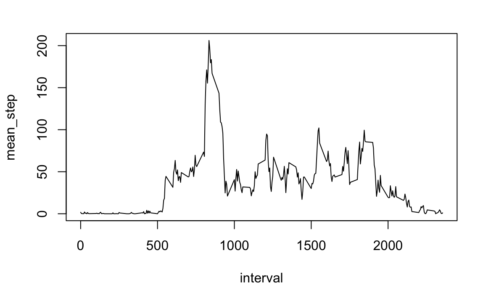
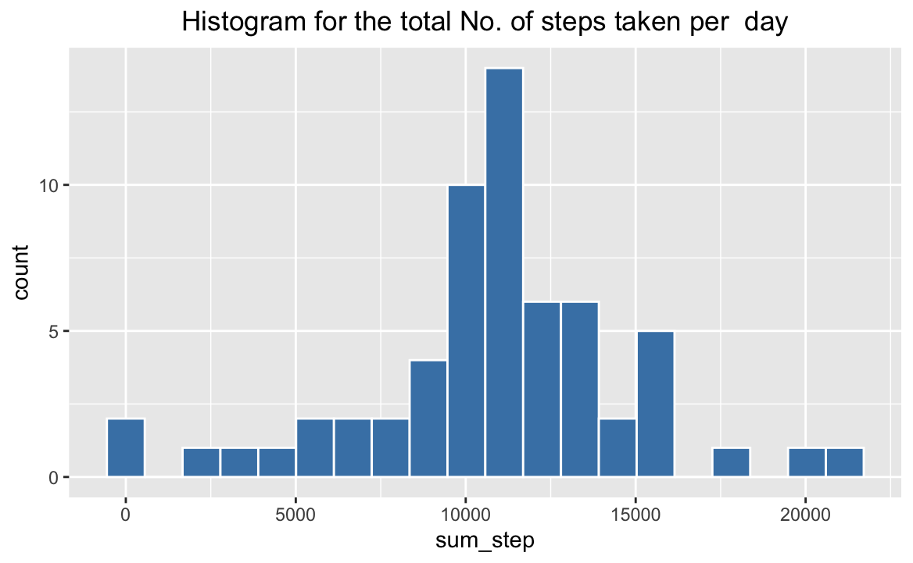
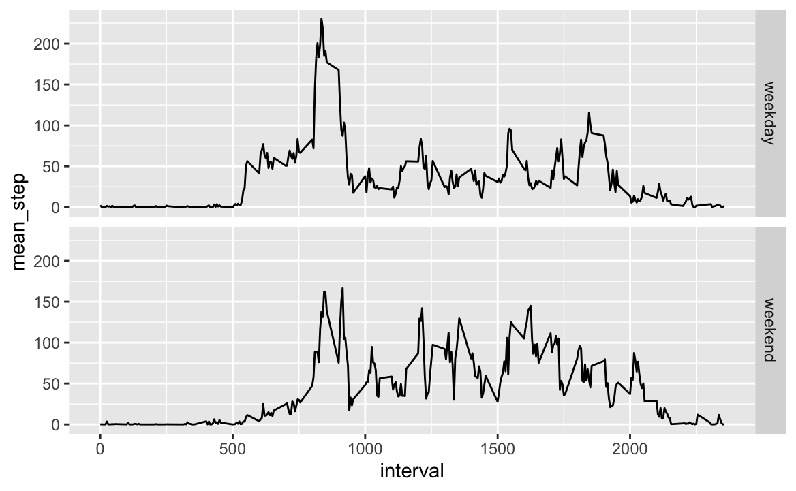

project1
================
Sophie Song
10/16/2019

### Loading and preprocessing the data

``` r
library(ggplot2)
library(dplyr)
library(plyr)
df <- read.csv("activity.csv") #read data
```

### Task1: What is mean total number of steps taken per day?

``` r
#calculate the total number, the mean and the median of steps taken per day
df1 <- df %>% filter(df$steps != "NA") %>% group_by(date) %>% dplyr::summarise(sum_step=sum(steps),mean_step=mean(steps),median_step=median(steps))

# display the total number, the mean and the median of steps taken per day
df1 
```

    ## # A tibble: 53 x 4
    ##    date       sum_step mean_step median_step
    ##    <fct>         <int>     <dbl>       <dbl>
    ##  1 2012-10-02      126     0.438           0
    ##  2 2012-10-03    11352    39.4             0
    ##  3 2012-10-04    12116    42.1             0
    ##  4 2012-10-05    13294    46.2             0
    ##  5 2012-10-06    15420    53.5             0
    ##  6 2012-10-07    11015    38.2             0
    ##  7 2012-10-09    12811    44.5             0
    ##  8 2012-10-10     9900    34.4             0
    ##  9 2012-10-11    10304    35.8             0
    ## 10 2012-10-12    17382    60.4             0
    ## # … with 43 more rows

``` r
#draw histogram
ggplot(df1,aes(x=sum_step))+geom_histogram(bins=20,fill="steelblue",color="white")+labs(title = "Histogram for the total No. of steps taken per  day")+theme(plot.title=element_text(hjust=0.5)) 
```

<!-- -->

### Task2: What is the average daily activity pattern?

``` r
#tidy the data
df2 <- df %>% filter(df$steps != "NA") %>% group_by(interval) %>% dplyr::summarise(mean_step = mean(steps)) 

#draw the graph
plot(mean_step~interval,data=df2,type="l") 
```

<!-- -->

``` r
#Find Which 5-minute interval, on average across all the days in the dataset, contains the maximum number of steps
df2[which.max(df2$mean_step),] 
```

    ## # A tibble: 1 x 2
    ##   interval mean_step
    ##      <int>     <dbl>
    ## 1      835      206.

### Task3: Imputing missing values

``` r
df3 <- df

#calculate the total number of missing values
plyr::count(df[is.na(df$steps),]$steps) 
```

    ##    x freq
    ## 1 NA 2304

``` r
#filling in all of the missing values in the dataset with the mean for that 5-minute interval
for (i in 1:nrow(df3)) {
  if (is.na(df3$steps[i])){
    df3$steps[i] = df2$mean_step[which(df2$interval == df3$interval[i])]
  } 
}

#Create a new dataset that is equal to the original dataset but with the missing data filled in.
head(df3)
```

    ##       steps       date interval
    ## 1 1.7169811 2012-10-01        0
    ## 2 0.3396226 2012-10-01        5
    ## 3 0.1320755 2012-10-01       10
    ## 4 0.1509434 2012-10-01       15
    ## 5 0.0754717 2012-10-01       20
    ## 6 2.0943396 2012-10-01       25

``` r
#Calculate the mean and median total number of steps taken per day
df4 <- df3 %>% group_by(date) %>% dplyr::summarise(sum_step=sum(steps),mean_step=mean(steps),median_step=median(steps))

#report the mean and median total number of steps taken per day
df4
```

    ## # A tibble: 61 x 4
    ##    date       sum_step mean_step median_step
    ##    <fct>         <dbl>     <dbl>       <dbl>
    ##  1 2012-10-01   10766.    37.4          34.1
    ##  2 2012-10-02     126      0.438         0  
    ##  3 2012-10-03   11352     39.4           0  
    ##  4 2012-10-04   12116     42.1           0  
    ##  5 2012-10-05   13294     46.2           0  
    ##  6 2012-10-06   15420     53.5           0  
    ##  7 2012-10-07   11015     38.2           0  
    ##  8 2012-10-08   10766.    37.4          34.1
    ##  9 2012-10-09   12811     44.5           0  
    ## 10 2012-10-10    9900     34.4           0  
    ## # … with 51 more rows

``` r
#draw histogram. Imputing missing data on the estimates of the total daily number of steps changes the shape of the graph
ggplot(df4,aes(x=sum_step))+geom_histogram(bins=20,fill="steelblue",color="white")+labs(title = "Histogram for the total No. of steps taken per  day")+theme(plot.title=element_text(hjust=0.5))
```

<!-- -->

### Task 4: Are there differences in activity patterns between weekdays and weekends?

``` r
#Create a new factor variable in the dataset with two levels – “weekday” and “weekend” indicating whether a given date is a weekday or weekend day.
df5 <- df3
df5$date <- as.Date(df5$date)
df5$week <- weekdays(df5$date)
df5$weekends_or_not <- ifelse(df5$week %in% c("Sunday","Saturday"),"weekend","weekday")

#calculate the average number of steps taken, averaged across all weekday days or weekend days
df6 <- df5 %>% group_by(interval,weekends_or_not) %>% dplyr::summarise(mean_step=mean(steps))

#Make the panel plot
ggplot(df6,aes(x=interval,y=mean_step))+geom_line()+facet_grid(weekends_or_not~.)
```

<!-- -->
